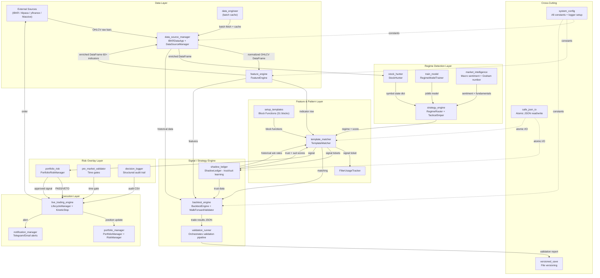

# 06 — Data Flow Diagram

**Generated**: 2026-05-15 | **Commit**: 6bc83e8  
**Tool**: Mermaid (flowchart). Module names are exact filenames (without .py).

---

## End-to-End Data Flow

---

## Key Data Objects (passed between modules)

| Object | From | To | Shape |
|--------|------|----|-------|
| OHLCV DataFrame | data_source_manager | feature_engine | pd.DataFrame (N rows × OHLCV cols) |
| Enriched DataFrame | feature_engine | template_matcher, strategy_engine, shadow_ledger | pd.DataFrame (N rows × 60+ indicator cols) |
| Stock State dict | stock_hunter | template_matcher | `{trend, structure, volatility, volume}` |
| Signal ticket | template_matcher | backtest_engine, live_trading_engine | `{symbol, template_id, confidence, stop, target, ...}` |
| Trust score | shadow_ledger | template_matcher | `{win_rate, decayed_wr, lifecycle}` |
| Risk gate result | portfolio_risk | live_trading_engine | `{passed: bool, reason: str, gate: str}` |
| Trade result | backtest_engine | validation_runner | JSON dict with PnL, bars_held, etc. |
| Template JSON | setup_templates (disk) | template_matcher | Loaded via TemplateManager |

---

## Unclear / Unverified Connections `[?]`

- `[?]` live_trading_engine → broker API (Alpaca/IBKR): exact order submission path not traced (asyncio + data_source_manager)
- `[?]` data_engineer → disk cache: cache format (parquet vs CSV vs JSON) not verified in this pass
- `[?]` train_model → live_trading_engine: model file path hardcoded vs config — not verified
